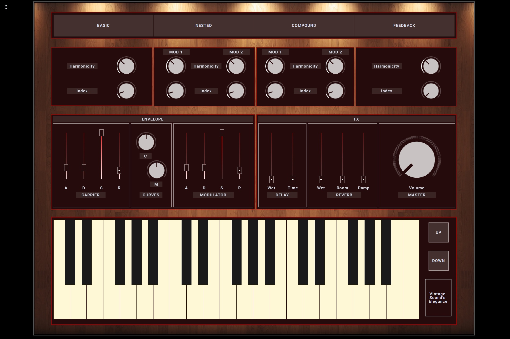

# **FM Synthesis with Supercollider**

## **Overview**

This is an OSC controlled FM synth with effects. This synth is implemented entirely using SuperCollider. The GUI is an external web control interface, with OSC communication, implemented with Open Stage Control. The synth can be played either using an external MIDI controller, or using the onscreen virtual keyboard. The synth provides 4 presets, along with the standard FM synth controls, envelopes, and effects. 

## **Features**
1. Elegant vintage look. 
2. Web GUI controls can be activated by any browser. 
3. Works with standard MIDI keyboards. 
4. Four presets: basic, compound, nested, feedback.
5. More than one available modality for each preset, harmonicity and index controller.
6. Possibility to control each parameter of the filters.
7. Effects: such as reverb and delay.
8. Possibility to control the envelope of carrier/modulator.

## **Instructions**
- The SC code can be run directly using SuperCollider. (in case of errors, run it twice)
- To run the GUI, download Open Stage Control from [here](https://openstagecontrol.ammd.net). 
  - On Open Stage Control, setup the send port as your local IP address, followed by the standard SuperCollider communication port. 
  - By default, the send port should be 127.0.0.1:57120
  - Set MIDI address to MIDI2SC:0,0 
  - Then, press run and in the new session open the included GUI json GUI file. 
  - You can control the GUI directly from the editor, but Open Stage Control should give you a local webpage in the debug window, which you can access using a web browser. 

## **Project report with detailed discussion**
[Project Report](https://drive.google.com/file/d/1zrEfXiz0DFIFXee0f9bh7F5d8C4V6DFa/view?usp=sharing)
